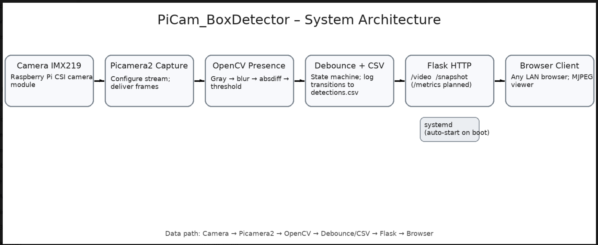
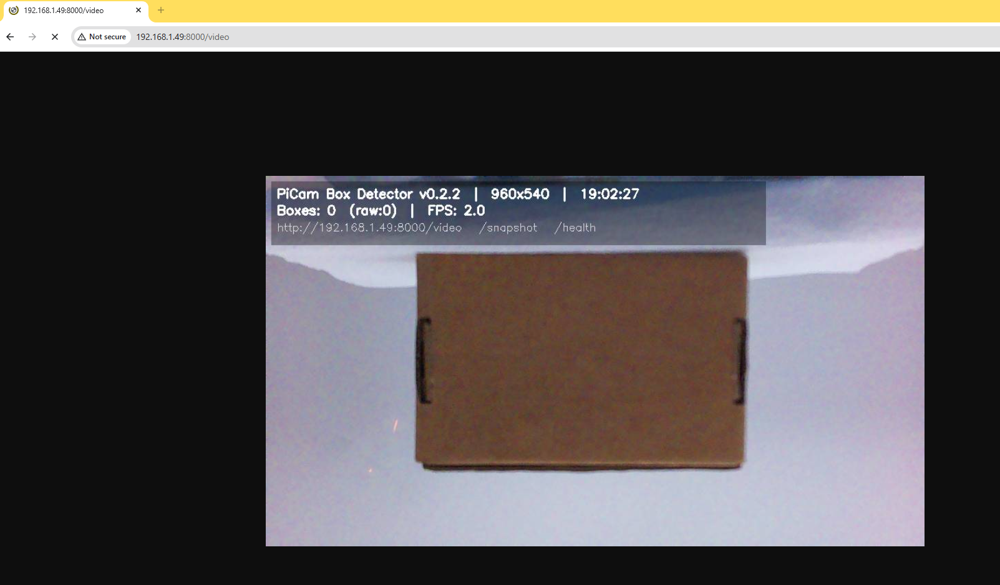
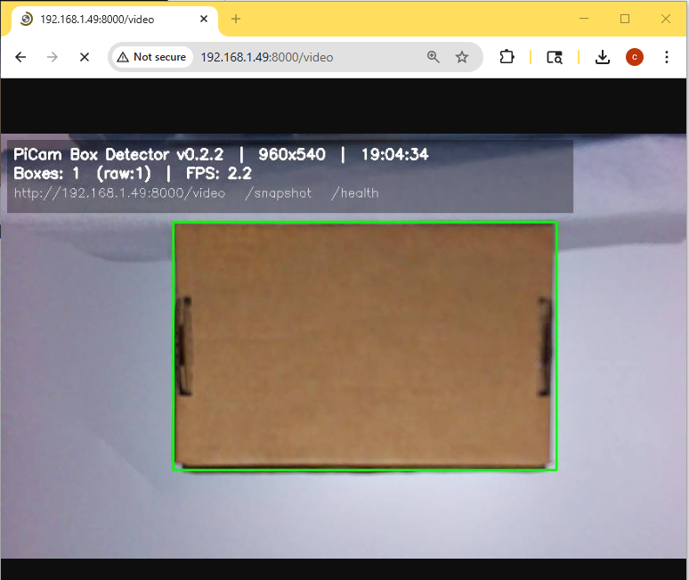
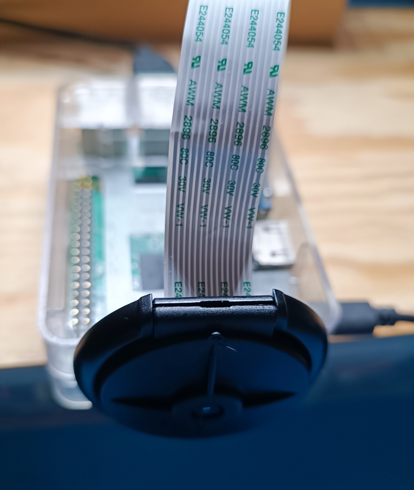

# PiCam Box Detector

I built a lightweight, real-time **box detector** on a Raspberry Pi using **Picamera2 + OpenCV + Flask**. It streams an MJPEG feed, draws a green rectangle around boxes (e.g., parcels), and exposes endpoints for snapshots, health, and config. It’s tuned for demos with a short warm-up and **debounced detections** so the “Boxes: 1” indicator is rock-solid.

- **Hardware:** Raspberry Pi 3 Model B + Pi Camera v2.1  
- **OS:** Raspberry Pi OS (Bookworm)  
- **Language:** Python 3


---

## What I built

- Live video at **`/video`** with a small HUD (version, FPS, IP/port, endpoints).  
- **`/video_raw`** to bypass detection for fast debugging.  
- **`/snapshot`** to save before/after pairs to `samples/`.  
- **`/health`** and **`/config`** for quick checks during demos.  
- Robust detection:
  - LAB + CLAHE → adaptive threshold → contours → convex quad / rotated rect.  
  - Warm-up (ignore first ~1s) + hysteresis (hits/misses) to prevent flicker.  
  - Full-frame guard so startup noise doesn’t count as a detection.
- Runs as a **systemd** service (auto-start on boot, restart on failure).

---

## Figure 1 — Landing

  
*Browser landing page at `http://192.168.1.49:8000` with links to `/video` and `/snapshot`.*

---

## Figure 2 — System Architecture

  
*Camera → Picamera2 → OpenCV (boxes) → Debounce/Hysteresis → Flask HTTP → Browser.*


---

## Figure 3 — Detection Sequence (Debounce Proof)

| No subject | Subject enters | Stable PRESENT |
|---|---|---|
|  |  |  |

*Debounce eliminates flicker during transitions.*

---

## Figure 4 — Hardware: Top View

  
*Raspberry Pi + IMX219 camera assembly.*

---

## Figure 5 — Hardware: Placement / Angle

  
*Camera aimed at the test scene (distance/angle visible).*

---

## Figure 6 — Ops Proof: systemd Status

")  
*Service enabled and running on boot.*

---

## Quickstart

```bash
sudo apt update
sudo apt install -y python3-picamera2 python3-opencv python3-flask

cd ~
git clone https://github.com/CDonohoe-Designs/PiCam_BoxDetector.git
cd PiCam_BoxDetector
python3 scripts/box_stream.py
Then open:

http://<pi-ip>:8000/video (detection + HUD)

http://<pi-ip>:8000/video_raw (raw camera only)

http://<pi-ip>:8000/snapshot (saves two JPGs to samples/)

http://<pi-ip>:8000/health

Run on boot (systemd)
bash
Copy code
sudo tee /etc/systemd/system/box-detector.service >/dev/null << 'EOF'
[Unit]
Description=PiCam Box Detector (Flask stream)
After=network-online.target
Wants=network-online.target

[Service]
Type=simple
User=rpicd
WorkingDirectory=/home/rpicd/PiCam_BoxDetector
ExecStartPre=/bin/sleep 3
ExecStart=/usr/bin/python3 /home/rpicd/PiCam_BoxDetector/scripts/box_stream.py
Restart=on-failure
RestartSec=2

# Optional env overrides (see “Config via env” below)
Environment=PYTHONUNBUFFERED=1
Environment=BOX_PORT=8000
Environment=BOX_JPEG_QUALITY=70
Environment=BOX_RES_W=960
Environment=BOX_RES_H=540

[Install]
WantedBy=multi-user.target
EOF

sudo systemctl daemon-reload
sudo systemctl enable --now box-detector
sudo systemctl status box-detector --no-pager
Endpoints I expose
Route	What I use it for
/video	Main MJPEG stream with HUD + debounced detection
/video_raw	Raw stream (camera/Flask sanity check)
/snapshot	Saves *_original.jpg and *_detected.jpg to samples/
/health	JSON “ok” with version/uptime
/config	IP, port, resolution, JPEG quality, uptime

Config via environment variables
BOX_PORT (default 8000)

BOX_RES_W, BOX_RES_H (e.g., 960x540 runs nicely on a Pi 3)

BOX_JPEG_QUALITY (default 70)

Set at runtime:

bash
Copy code
sudo systemctl set-environment BOX_RES_W=960 BOX_RES_H=540 BOX_JPEG_QUALITY=70
sudo systemctl restart box-detector
How it works (short)
LAB + CLAHE → adaptive threshold → contours → convex quad / rotated rect

Warm-up (~1s) and hysteresis (hits/misses) to suppress flicker

Full-frame guard on startup to avoid false positives

Tuning notes
Keep a small border between the box and frame edges (cleaner contours).

Avoid glare; even lighting works best.

For smoothness on a Pi 3, 960×540 at JPEG quality ~70 feels good.

My workflow
bash
Copy code
cd ~/PiCam_BoxDetector && git pull
sudo systemctl restart box-detector
journalctl -u box-detector -f
Troubleshooting
“Device or resource busy” — stop the service before running the script manually:

bash
Copy code
sudo systemctl stop box-detector
python3 scripts/box_stream.py
500 on /video — use /video_raw to isolate camera/Flask; then check logs:

bash
Copy code
journalctl -u box-detector -n 80 --no-pager -l
Port already in use

bash
Copy code
sudo fuser -k 8000/tcp
sudo systemctl restart box-detector
markdown
Copy code


