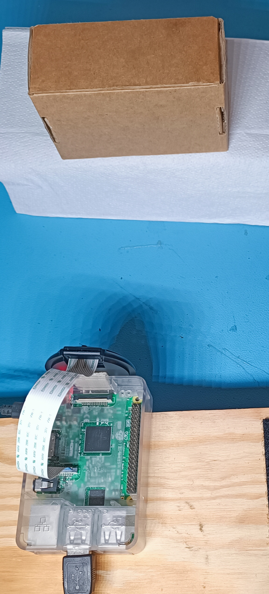

# PiCam Box Detector

I built a lightweight, real-time **box detector** on a Raspberry Pi using **Picamera2 + OpenCV + Flask**. It streams an MJPEG feed, draws a green rectangle around boxes (e.g., parcels), and exposes endpoints for snapshots, health, and config. It’s tuned for demos with a short warm-up and **debounced detections** so the “Boxes: 1” indicator is rock-solid.

- **Hardware:** Raspberry Pi 3 Model B + Pi Camera v2.1  
- **OS:** Raspberry Pi OS (Bookworm)  
- **Language:** Python 3

> Images live in `docs/images/`. Filenames below must match exactly (case-sensitive).

---

## What I built

- Live video at **`/video`** with a small HUD (version, FPS, IP/port, endpoints).  
- **`/video_raw`** to bypass detection for fast debugging.  
- **`/snapshot`** to save before/after pairs to `samples/`.  
- **`/health`** and **`/config`** for quick checks during demos.  
- Robust detection:
  - LAB + CLAHE → adaptive threshold → contours → convex quad / rotated rect.  
  - Warm-up (ignore first ~1s) + hysteresis (hits/misses) to prevent flicker.  
  - Full-frame guard so startup noise doesn’t count as a detection.
- Runs as a **systemd** service (auto-start on boot, restart on failure).

---

## Figure 1 — Landing

  
*Browser landing page at `http://<pi-ip>:8000` with links to `/video` and `/snapshot`.*

---

## Figure 2 — System Architecture

  
*Camera → Picamera2 → OpenCV (boxes) → Debounce/Hysteresis → Flask HTTP → Browser.*

---

## Figure 3 — Stream UI (Detail)

  
*A clean 720p MJPEG stream served by Flask.*

---

## Figure 4 — Detection Sequence (Debounce Proof)

| No subject | Subject enters | Stable PRESENT |
|---|---|---|
|  |  |  |

*Debounce eliminates flicker during transitions.*

---

## Figure 5 — ROI / Overlay (Optional)

  
*Region-of-interest drawn to focus detection.*

---

## Figure 6 — Metrics: Raw CSV Transitions

")  
*Each row is a debounced flip: `timestamp,present` (1=present, 0=absent).*

---

## Figure 7 — Metrics: Timeline Chart

  
*Presence episodes over time derived from the CSV.*

---

## Figure 8 — Hardware: Top View

  
*Raspberry Pi + IMX219 camera assembly.*

---

## Figure 9 — Hardware: Placement / Angle

  
*Camera aimed at the test scene (distance/angle visible).*

---

## Figure 10 — Ops Proof: systemd Status

")  
*Service enabled and running on boot.*

---

## Figure 11 — Ops Proof: Reachability

  
*HTTP endpoint reachable on the LAN.*

---

## Quickstart

```bash
sudo apt update
sudo apt install -y python3-picamera2 python3-opencv python3-flask

cd ~
git clone https://github.com/CDonohoe-Designs/PiCam_BoxDetector.git
cd PiCam_BoxDetector
python3 scripts/box_stream.py

