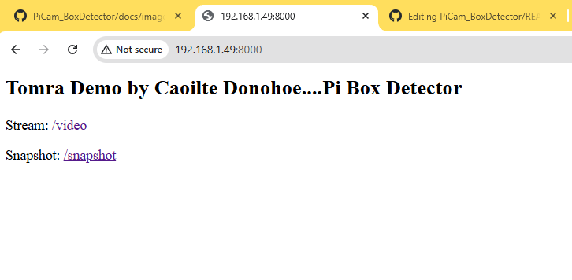
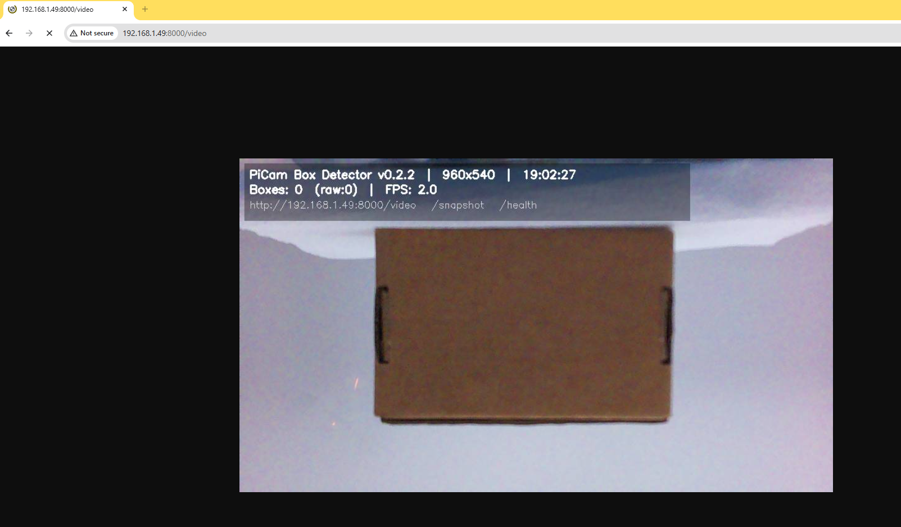
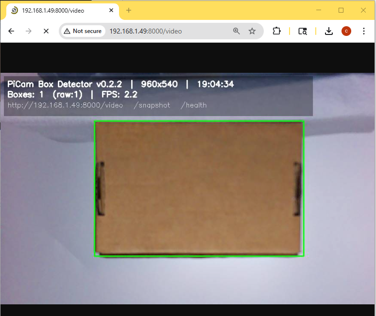
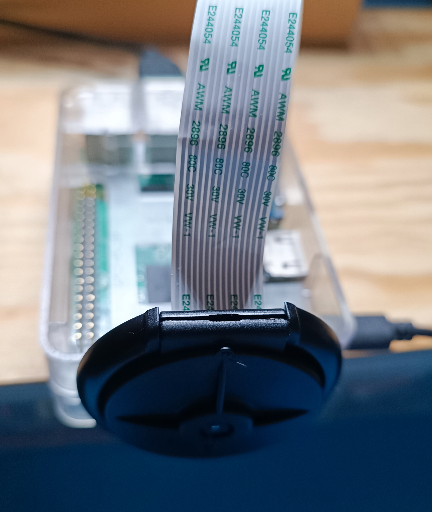

# PiCam Box Detector

I built a lightweight, real-time box detector on a Raspberry Pi using Picamera2 + OpenCV + Flask. It streams an MJPEG feed, draws a green rectangle around boxes (e.g., parcels), and exposes endpoints for snapshots, health, and config. It’s tuned for demos with a short warm-up and debounced detections so the **“Boxes: 1”** indicator is rock-solid.

> **Two-stage approach**
> - **Stage 1 — Classic OpenCV:** lightweight contour/quad detector using Picamera2 + OpenCV + Flask; same endpoints, fast on Pi 3B.
> - **Stage 2 — YOLO (ONNX / OpenCV-DNN):** drop-in upgrade with a trained model for better robustness; Note: Some features not present as per Stage 1
> - 
## Setup


- **Hardware:** Raspberry Pi 3 Model B + Pi Camera v2.1  
- **OS:** Raspberry Pi OS (Bookworm)  
- **Language:** Python 3


---

## What I built

- Live video at **`/video`** with a small HUD (version, FPS, IP/port, endpoints).  
- **`/snapshot`** to save before/after pairs to `samples/`.  
- **`/health`** and **`/config`** for quick checks during demos.  
- Robust detection:
  - LAB + CLAHE → adaptive threshold → contours → convex quad / rotated rect.  
  - Warm-up (ignore first ~1s) + hysteresis (hits/misses) to prevent flicker.  
  - Full-frame guard so startup noise doesn’t count as a detection.
- Runs as a **systemd** service (auto-start on boot, restart on failure).

---

## Figure 1 — Landing

  
*Browser landing page at `http://192.168.1.49:8000` with links to `/video` and `/snapshot`.*

---

## Figure 2 — System Architecture

  
*Camera → Picamera2 → OpenCV (boxes) → Debounce/Hysteresis → Flask HTTP → Browser.*


---

## Figure 3 — Detection Sequence (Debounce Proof)

| No subject | Subject enters | Stable PRESENT |
|---|---|---|
|  |  |  |

*Debounce eliminates flicker during transitions.*

---

## Figure 4 — Hardware: Top View

  
*Raspberry Pi + IMX219 camera assembly.*

---

## Figure 5 — Hardware: Placement / Angle

  
*Camera aimed at the test scene (distance/angle visible).*

---

## Figure 6 — Ops Proof: systemd Status

")  
*Service enabled and running on boot.*

---
## Quickstart

```bash
sudo apt update
sudo apt install -y python3-picamera2 python3-opencv python3-flask

cd ~
git clone https://github.com/CDonohoe-Designs/PiCam_BoxDetector.git
cd PiCam_BoxDetector
python3 scripts/box_stream.py
```

Then open:

- `http://<pi-ip>:8000/video` (detection + HUD)  
- `http://<pi-ip>:8000/snapshot` (saves two JPGs to `samples/`)  
- `http://<pi-ip>:8000/health`

---

## Run on boot (systemd)

```bash
sudo tee /etc/systemd/system/box-detector.service >/dev/null << 'EOF'
[Unit]
Description=PiCam Box Detector (Flask stream)
After=network-online.target
Wants=network-online.target

[Service]
Type=simple
User=rpicd
WorkingDirectory=/home/rpicd/PiCam_BoxDetector
ExecStartPre=/bin/sleep 3
ExecStart=/usr/bin/python3 /home/rpicd/PiCam_BoxDetector/scripts/box_stream.py
Restart=on-failure
RestartSec=2

# Optional env overrides (see “Config via env” below)
Environment=PYTHONUNBUFFERED=1
Environment=BOX_PORT=8000
Environment=BOX_JPEG_QUALITY=70
Environment=BOX_RES_W=960
Environment=BOX_RES_H=540

[Install]
WantedBy=multi-user.target
EOF

sudo systemctl daemon-reload
sudo systemctl enable --now box-detector
sudo systemctl status box-detector --no-pager
```

---

## Endpoints I expose

| Route        | What I use it for                                         |
|--------------|------------------------------------------------------------|
| `/video`     | Main MJPEG stream with HUD + debounced detection           |
| `/snapshot`  | Saves `*_original.jpg` and `*_detected.jpg` to `samples/`  |
| `/health`    | JSON “ok” with version/uptime                              |
| `/config`    | IP, port, resolution, JPEG quality, uptime                 |

---

## Config via environment variables

- `BOX_PORT` (default `8000`)  
- `BOX_RES_W`, `BOX_RES_H` (e.g., `960x540` runs nicely on a Pi 3)  
- `BOX_JPEG_QUALITY` (default `70`)

Set at runtime:

```bash
sudo systemctl set-environment BOX_RES_W=960 BOX_RES_H=540 BOX_JPEG_QUALITY=70
sudo systemctl restart box-detector
```

---

## How it works (short)

- LAB + CLAHE → adaptive threshold → contours → convex quad / rotated rect  
- Warm-up (~1s) and hysteresis (hits/misses) to suppress flicker  
- Full-frame guard on startup to avoid false positives

---

## Tuning notes

- Keep a small border between the box and frame edges (cleaner contours).  
- Avoid glare; even lighting works best.  
- For smoothness on a Pi 3, `960×540` at JPEG quality ~70 feels good.

---

## My workflow

```bash
cd ~/PiCam_BoxDetector && git pull
sudo systemctl restart box-detector
journalctl -u box-detector -f
```

---

## Troubleshooting

**“Device or resource busy”** — stop the service before running the script manually:
```bash
sudo systemctl stop box-detector
python3 scripts/box_stream.py
```

**Port already in use**
```bash
sudo fuser -k 8000/tcp
sudo systemctl restart box-detector
```

# Stage 2 — OpenCV → YOLO (upgraded detector)

I kept the **same Flask app ** and swapped the detection core to a small **YOLO** model. This stage improves robustness in tricky lighting and angles while preserving the Stage‑1 UX and URLs.

- **Models:** custom-trained or generic tiny YOLO, exported to **ONNX**
- **Backends:** CPU with **ONNX Runtime** or **OpenCV DNN** (no PyTorch required on the Pi)
- **Debounce/HUD:** unchanged — the “Boxes: 1” behavior remains stable

## Quickstart (YOLO)

```bash
# 1) Put your ONNX model on the Pi
#    (e.g., last.onnx from your PC export)
mkdir -p ~/PiCam_BoxDetector/models/box320
scp last.onnx rpicd@<pi-ip>:~/PiCam_BoxDetector/models/box320/last.onnx

# 2) Run the YOLO server
# If your script is scripts/box_stream_yolo.py
python3 ~/PiCam_BoxDetector/scripts/box_stream_yolo.py

# 3) Open the same pages as Stage 1
# http://<pi-ip>:8000/ (landing, if added)
# http://<pi-ip>:8000/video
# http://<pi-ip>:8000/snapshot
# http://<pi-ip>:8000/health
```

### Run on boot (YOLO systemd)

```ini
# /etc/systemd/system/box_stream_yolo.service
[Unit]
Description=PiCam Box Detector (YOLO)
After=network-online.target

[Service]
Type=simple
User=rpicd
WorkingDirectory=/home/rpicd/PiCam_BoxDetector
ExecStart=/usr/bin/python3 /home/rpicd/PiCam_BoxDetector/scripts/box_stream_yolo.py
Restart=always

[Install]
WantedBy=multi-user.target
```

```bash
sudo systemctl daemon-reload
sudo systemctl enable --now box_stream_yolo
sudo systemctl status box_stream_yolo --no-pager
```

### Notes on backends

- **ONNX Runtime (CPU):** Works if installed for your OS/arch; provides good compatibility with YOLO ONNX exports.  
- **OpenCV DNN:** Loads the same `.onnx` without ONNX Runtime or PyTorch. This is the simplest option because i useded an older RPi 3 Model 3.

### Exporting my YOLO to ONNX (on my PC)

```bash
# Use the Ultralytics CLI on my PC/laptop
# imgsz matched training size (320)
yolo export model="/path/to/last.pt" format=onnx imgsz=320 opset=12 dynamic=False simplify=True
# Copy last.onnx -> ~/PiCam_BoxDetector/models/box320/last.onnx on the Pi
```


### Figure 7 — Detection Sequence (YOLO, Debounce Proof)

| Subject enters (YOLO) | Stable PRESENT (YOLO) |
|---|---|
| ") | ") |

| Subject enters (YOLO) | Stable PRESENT (YOLO) |
|---|---|
| ") | ") |

*Same debounce behavior as Stage 1, now powered by YOLO.*

---

## How it works (Stage 2)

- **Pre‑process**: resize/letterbox to `imgsz` (e.g., 320/640), normalize to 0–1.  
- **Inference**: run ONNX model on CPU (ONNX Runtime or OpenCV DNN).  
- **Post‑process**: decode YOLO outputs → NMS → “box‑like” filter (area & aspect).  
- **Debounce & HUD**: identical to Stage 1 for stable **“Boxes: 1”** display.

---

## Tuning notes (Stage 2)

- Prefer a **small model** and **lower imgsz** on older Pis (e.g., 320).  
- Use **FRAME_SKIP** in your script to keep the stream responsive.  
- Keep thresholds conservative (`CONF_THRESH`, `IOU_THRESH`) for low false positives.


---

